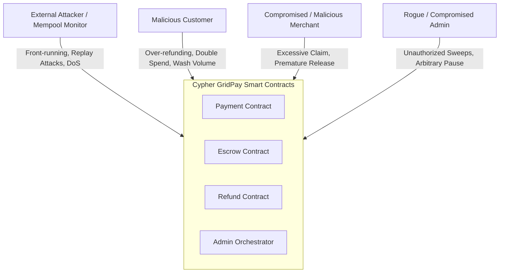

# Security Policy

This document describes the security policy, vulnerability disclosure process, threat model, smart contract security scope, and reporting procedures for the Cypher GridPay smart contracts repository.

---

## 1. Vulnerability Reporting Process

If you discover a security vulnerability in Cypher GridPay smart contracts, please report it responsibly and privately. **Do NOT disclose vulnerabilities publicly until a fix has been developed, tested, and released.**

### 1.1 Reporting Contacts

- **Security Team Email**: `security@gridpay.network`
- **Alternative Contact**: `security@cyphergridpay.io`
- **PGP Fingerprint**: `9F3B 7A21 C45D 8E67 2B10 4F92 A834 E190 C7D5 8B2F`

All sensitive vulnerability reports must be encrypted using our PGP public key provided below.

### 1.2 Reporting PGP Public Key

```
-----BEGIN PGP PUBLIC KEY BLOCK-----
Version: OpenPGP.js v4.10.10
Comment: Cypher GridPay Security Team <security@gridpay.network>

mQENBF+V2/ABCBC5sV6fHwWzQzP7mQ5wE9J7XqL+ZkY3rT4vN8wP1aC2dE4fG6hI
8jK0lM2nO4pQ6rS8tU0vW2xY4zA6bC8dE0fG2hI4jK6lM8nO0pQ2rS4tU6vW8xY0
zA2bC4dE6fG8hI0jK2lM4nO6pQ8rS0tU2vW4xY6zA8bC0dE2fG4hI6jK8lM0nO2p
Q4rS6tU8vW0xY2zA4bC6dE8fG0hI2jK4lM6nO8pQ0rS2tU4vW6xY8zA0bC2dE4fG
6hI8jK0lM2nO4pQ6rS8tU0vW2xY4zA6bC8dE0fG2hI4jK6lM8nO0pQ2rS4tU6vW8
xY0zA2bC4dE6fG8hI0jK2lM4nO6pQ8rS0tU2vW4xY6zA8bC0dE2fG4hI6jK8lM0n
O2pQ4rS6tU8vW0xY2zA4bC6dE8fG0hI2jK4lM6nO8pQ0rS2tU4vW6xY8zA0bC2dE
4fG6hI8jK0lM2nO4pQ6rS8tU0vW2xY4zA6bC8dE0fG2hI4jK6lM8nO0pQ2rS4tU6
vW8xY0zA2bC4dE6fG8hI0jK2lM4nO6pQ8rS0tU2vW4xY6zA8bC0dE2fG4hI6jK8l
M0nO2pQ4rS6tU8vW0xY2zA4bC6dE8fG0hI2jK4lM6nO8pQ0rS2tU4vW6xY8zA0bC
2dE4fG6hI8jK0lM2nO4pQ6rS8tU0vW2xY4zA6bC8dE0fG2hI4jK6lM8nO0pQ2rS4
tU6vW8xY0zA2bC4dE6fG8hI0jK2lM4nO6pQ8rS0tU2vW4xY6zA8bC0dE2fG4hI6j
K8lM0nO2pQ4rS6tU8vW0xY2zA4bC6dE8fG0hI2jK4lM6nO8pQ0rS2tU4vW6xY8z
A0bC2dE4fG6hI8jK0lM2nO4pQ6rS8tU0vW2xY4zA6bC8dE0fG2hI4jK6lM8nO0pQ
=wQ9Z
-----END PGP PUBLIC KEY BLOCK-----
```

### 1.3 What to Include in a Report

To accelerate triage, please include:
1. **Summary & Threat Analysis**: Description of the vulnerability and expected business/economic impact.
2. **Target Components**: Specific contract name, file path, line numbers, and function names.
3. **Reproduction Proof-of-Concept (PoC)**: Minimal Soroban Rust test case or CLI sequence reproducing the exploit.
4. **Proposed Remediation**: Suggested code modifications or invariant assertions if available.

---

## 2. Coordinated Disclosure Timelines

We strictly adhere to a coordinated vulnerability disclosure policy with clear service level agreements (SLAs):

| Phase | Standard Timeline | Expedited (Critical / High) |
|---|---|---|
| **Initial Acknowledgment** | Within 48 hours | Within 24 hours |
| **Triage & Reproducibility Assessment** | Within 5 business days | Within 48 hours |
| **Patch Development & Testing** | 2 – 3 weeks | 3 – 5 days |
| **Downstream Integrator Notice** | 5 days prior to release | 48 hours prior to release |
| **Public Coordinated Disclosure** | 30 days from initial report | Upon patch deployment |

---

## 3. Threat Model

Cypher GridPay operates as non-custodial payment and escrow infrastructure on the Stellar network. The core threat model analyzes four primary categories of actors and risks:



### 3.1 Attacker Profiles & Motivations
- **External Adversary / Front-runner**: Monitors public Soroban transaction pools to intercept settlements, front-run dispute deadlines, or replay signatures across different payment channels or contracts.
- **Malicious Buyer / Payer**: Attempts double-refunds, voucher duplication, or exhausting merchant collateral by rapid request spamming.
- **Malicious / Compromised Merchant**: Attempts to claim unvested milestone deposits, breach customer spending caps, or avoid dispute evidence requirements.
- **Compromised Admin Key**: Attempts to withdraw non-fee contract reserves (merchant escrowed balances) or indefinitely pause the system.

### 3.2 Key Attack Vectors & Mitigations

| Threat / Attack Vector | Target Surface | Mitigation Mechanism |
|---|---|---|
| **Dispute Deadline Front-running** | Escrow disputes | Automatic 24h grace period extension for late evidence submission (<= 2h before deadline). |
| **Channel Signature Cross-Replay** | Payment channels | Cryptographic signatures strictly bind `channel_id`, `merchant_amount`, strictly increasing `nonce`, and `current_contract_address()`. |
| **Collateral Depletion via Fee Sweeps** | Protocol fees | Mathematical assertion `sweep_amount <= accumulated_fees`; multi-sig governance required above threshold. |
| **Ledger Spam / Resource Exhaustion** | Public entrypoints | Sliding-window per-caller rate limiting reverting with `RateLimitExceeded`. |
| **Checks-Effects-Interactions (CEI) Violations** | Transfers & payouts | State flags and counters committed before external token client transfers. |
| **Conservation of Funds Invariants** | Escrow & split payouts | `deposited == settled + customer_refund` asserted at all settlement points. |

---

## 4. Smart Contract Security Scope

### 4.1 In-Scope Components

The following Soroban contracts are within scope for security review and bug reports:

| Contract | Path | Critical Assets Protected |
|---|---|---|
| `PaymentContract` | `core/contracts/payment/` | Direct payments, payment channels, fee sweeps, subscriptions |
| `EscrowContract` | `core/contracts/escrow/` | Milestone vesting, multi-party deposits, dispute arbitration |
| `RefundContract` | `core/contracts/refund/` | Refund authorization, vouchers, cooling-off periods |
| `AdminContract` | `orchestrator/contracts/admin/` | Multi-contract cross-registration, emergency pause orchestrator |

### 4.2 Severity Classification

- **Critical**: Direct, irreversible loss of user funds, contract insolvency, or complete authorization bypass without prerequisite permissions.
- **High**: Temporary freezing of funds without admin recovery, manipulation of vesting milestones, or fee calculation evasion.
- **Medium**: Griefing attacks, bypass of customer rate limits, denial of service requiring contract re-initialization.
- **Low**: Event emission discrepancies, off-by-one errors in non-monetary timestamps, minor informational inconsistencies.

### 4.3 Out of Scope

- Third-party Stellar RPC nodes, Horizon infrastructure, or Stellar Core bugs.
- Social engineering, phishing, or physical attacks targeting administrators or users.
- Issues in local dev scripts or documentation that do not impact deployed on-chain contract security.

---

## 5. Security Best Practices for Integrators

1. **Always Verify Contract Addresses**: Confirm contract IDs against the official deployment manifest.
2. **Listen for Contract Events**: Audit state transitions by indexing Soroban events (`PaymentCreated`, `ChannelSettled`, `EscrowCompleted`).
3. **Use Multi-Signature for Governance**: Never configure single-key signers for admin thresholds in production.
4. **Respect Rate Limits & Cooldowns**: Gracefully handle `RateLimitExceeded` (Code 106) and `RefundCooldownActive` (Code 33).
